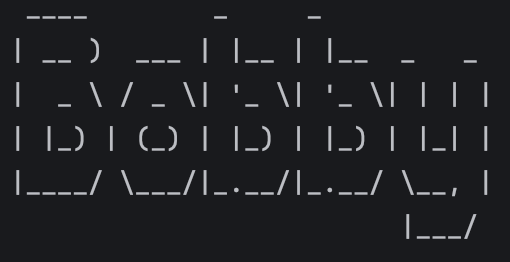

# Bobby User Guide


Bobby is a simple command-line application which works as a task manager.   
With Bobby, you will be able to track and manage your tasks more efficiently.

Bobby supports three types of tasks:  
- ***Todo*** - tasks without a specific date or time  
- ***Deadline*** - tasks that need to be completed by a specific date/time  
- ***Event*** - tasks that have a start and end date/time  

***
# Features

## 1. Add a Todo

To add a Todo task into your list,
use the `todo` command followed by the task description.

### Format

```text
todo <description>
```
### Example:
```text
todo buy milk  
```

Expected output:
```
~~~~~~~~~~~~~~~~~~~~~~~~~~~~~~~~~~~~~~~
    added: 
    	[T][ ] buy milk
    You now have 1 pending tasks.
~~~~~~~~~~~~~~~~~~~~~~~~~~~~~~~~~~~~~~~
```
---

## 2. Add a Deadline

To add a Deadline task into your list,
use the `deadline` command 
followed by the task description, then 
the deadline with a leading forward slash.

### Format

```text
deadline <description> / <deadline>
```
### Example:
```text
deadline submit assignment / Monday 2pm  
```
Expected output:
```
~~~~~~~~~~~~~~~~~~~~~~~~~~~~~~~~~~~~~~~~~~~~~~~~~~~~~
    added:
        [D][ ] submit assignment -> by: Monday 2pm
    You now have 1 pending tasks.
~~~~~~~~~~~~~~~~~~~~~~~~~~~~~~~~~~~~~~~~~~~~~~~~~~~~~
```
---

## 3. Add an Event
To add a Event task into your list,
use the `event` command followed by the task description, 
then the start and end times.   

The start and end times should each have a leading forward slash. 

### Format

```text
event <description> / <start> / <end>
```

### Example

```text
event project meeting / Monday 1pm / Monday 2pm
```
Expected output:
```
~~~~~~~~~~~~~~~~~~~~~~~~~~~~~~~~~~~~~~~~~~~~~~~~~~~~~~~~~~~~~~~~~~~~~~~~~~~~
    added:
        [E][ ] project meeting -> Start: {Monday 1pm} ~ End: {Monday 2pm}
    You now have 1 pending tasks.
~~~~~~~~~~~~~~~~~~~~~~~~~~~~~~~~~~~~~~~~~~~~~~~~~~~~~~~~~~~~~~~~~~~~~~~~~~~~
```
---

## 4. List All Tasks

To view your list of tasks, simply use the command `list`.

### Example
```text
list

~~~~~~~~~~~~~~~~~~~~~~~~~~~~~~~~~~~~~~~~~~~~~~~~~~~~~~~~~~~~~~~~~~~~~~~~~~~~~~~
    Here are your tasks:
	1. [T][ ] buy milk
	2. [D][ ] submit assignment -> by: Monday 2pm
	3. [E][ ] project meeting -> Start: {Monday 1pm} ~ End: {Monday 2pm}
	
~~~~~~~~~~~~~~~~~~~~~~~~~~~~~~~~~~~~~~~~~~~~~~~~~~~~~~~~~~~~~~~~~~~~~~~~~~~~~~~
```

---

## 5. Mark a task as done
To mark a task as completed, use the command `mark` 
followed by the corresponding task number.
### Format

```text
mark <task number>
```

### Example

```text
mark 1
```
Expected output:
```
~~~~~~~~~~~~~~~~~~~~~~~~~~~~~~~~~~~~~~~~~~~~~~~~~~
    Good, this task is done: [T][X] buy milk
~~~~~~~~~~~~~~~~~~~~~~~~~~~~~~~~~~~~~~~~~~~~~~~~~~
```

---
## 6. Mark a task as undone

To mark a task as uncompleted, use the command `unmark`
followed by the corresponding task number.
### Format

```text
unmark <task number>
```

### Example

```text
unmark 1
```
Expected output:
```
~~~~~~~~~~~~~~~~~~~~~~~~~~~~~~~~~~~~~~~~~~~~~~~~~~~~~~
    Okay, this task is not done: [T][ ] buy milk
~~~~~~~~~~~~~~~~~~~~~~~~~~~~~~~~~~~~~~~~~~~~~~~~~~~~~~
```

---

## 7. Delete a Task

To delete a task, use the command `delete`
followed by the corresponding task number.
### Format

```text
delete <task number>
```

### Example

```text
delete 1
```
Expected output:
```
~~~~~~~~~~~~~~~~~~~~~~~~~~~~~~~~~~~~~~~
    removed: 
	[T][ ] buy milk
    You now have 2 pending tasks.
~~~~~~~~~~~~~~~~~~~~~~~~~~~~~~~~~~~~~~~
```

---
## 8. Find a Task

To find a task, use the command `find`
followed by the keyword that matches your desired task best.
### Format

```text
find <keyword>
```

### Example

```text
find milk
```
Expected output:
```
~~~~~~~~~~~~~~~~~~~~~~~~~~~~~~~~~~~~~~~~~~~~~~~~~~~~~~~~~~~~~~~~~~~~~~~
    Here are the matched tasks:
	1. [T][ ] buy milk
	2. [D][ ] finish milk -> by: 7 July
	3. [E][ ] milk promotion -> Start: {1 July} ~ End: {10 July}
	
~~~~~~~~~~~~~~~~~~~~~~~~~~~~~~~~~~~~~~~~~~~~~~~~~~~~~~~~~~~~~~~~~~~~~~~
```

---

## 9. Exit the Program

To quit, just use the command `bye`.  

Your tasks will be saved so that they can be loaded again the next time Bobby is started.

### Example

```text
bye

~~~~~~~~~~~~~~~~~~
    Bye Bye!
~~~~~~~~~~~~~~~~~~
```
---

## Saving your data

Bobby automatically saves your list after every change.
Your task list is automatically loaded when Bobby starts and saved when exiting.
---

| Command | Format | Description |
| --- | --- | --- |
| `todo` | `todo <description>` | Adds a Todo task |
| `deadline` | `deadline <description> / <deadline>` | Adds a Deadline task |
| `event` | `event <description> / <start> / <end>` | Adds an Event task |
| `list` | `list` | Lists all tasks |
| `mark` | `mark <task number>` | Marks a task as done |
| `unmark` | `unmark <task number>` | Marks a task as not done |
| `delete` | `delete <task number>` | Deletes a task |
| `find` | `find <keyword>` | Finds tasks containing the keyword |
| `bye` | `bye` | Exits Bobby |